# Real-Solutions

A web application where a user can view real estate listings and submit offers, have the offers go to all appropriate parties, and the the seller can view on all offers in one area.

## Problem Domain

When a seller lists their home, many times there are multiple offers that come in.  For the agent, presenting those offers can be cumbersome and time consuming.  Having a single source of collecting these offers can make it simpler and faster in viewing these offers.  It also makes the decision making process easier and more efficient for all parties involved.

## User Stories

---

### User Story 1: Seller’s Agent - Create Listings

As a seller’s agent, I want to be able to have an online form with my property listings so that buyers agents can easily submit their offers to me and my seller.

Feature Tasks

- [x] Create a property listing
- [x] Create seller contact
- [x] Bind seller and property together

Acceptance Test

Ensure seller is bound to the property and see submitted offers.

### User Story 2: Seller’s Agent - Receive Offers from Buyers Agents

As a seller’s agent, I want to be able to receive offers from other buyers' agents via my online form and be able to see them in a consolidated location for quick decision making.

Feature Tasks

- [x] Create an offer submission collection page
- [x] Create a checkbox to indicate as a favorite offer
- [x] Create a comment field box to communicate with seller and/or buyers agent
- [x] Create buttons to either Accept, Counter or Reject the offer.

Acceptance Test

Ensure sellers can view all offers bound to their property.

### User Story 3: Seller- Receive and View Offers on my property

As a seller, I want to be able to view all the offers on my home in a single consolidated location.  

Feature Tasks

- [x] Create an offer submission collection page
- [x] Create a checkbox to indicate as a favorite offer
- [x] Create a comment field box to communicate with seller and/or buyers agent
- [x] Create buttons to either Accept, Counter or Reject the offer.

Acceptance Test

Ensure sellers can view all offers bound to their property.

### User Story 4: Seller- Communicate with my agent regarding each submitted offer

As a seller, I want to be able to view an offer and either make a comment about it, or send a quick message to my agent. I would also like to be able to see a history of all the messages to keep track of the communication flow.  

Feature Tasks

- [x] Create a text area message field for each offer submission page.
- [x] Create a communication collection point to see all messages/comments for any given offer.

Acceptance Test

Ensure sellers and agents can see each others comments and messages for each offer.

---

## Wireframes

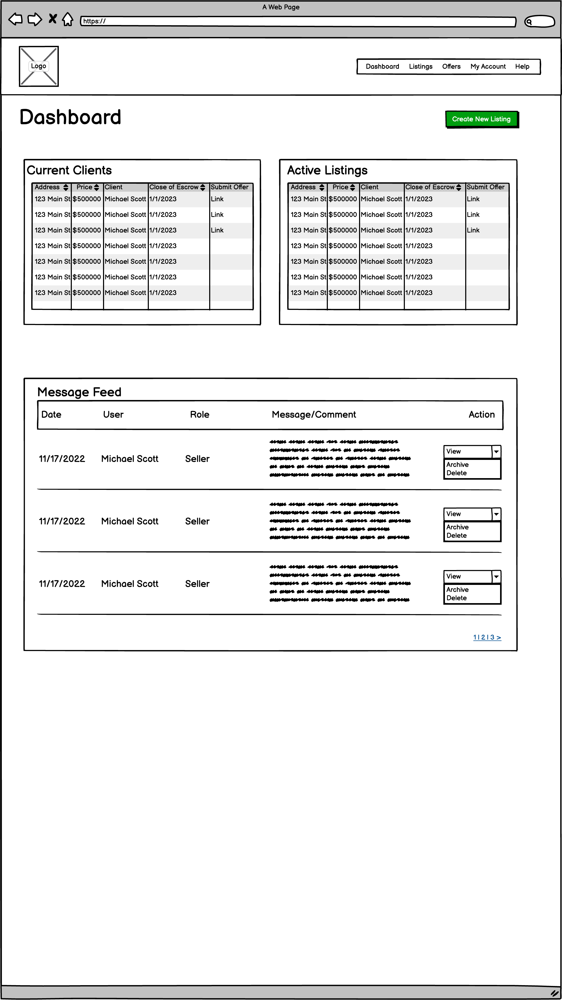
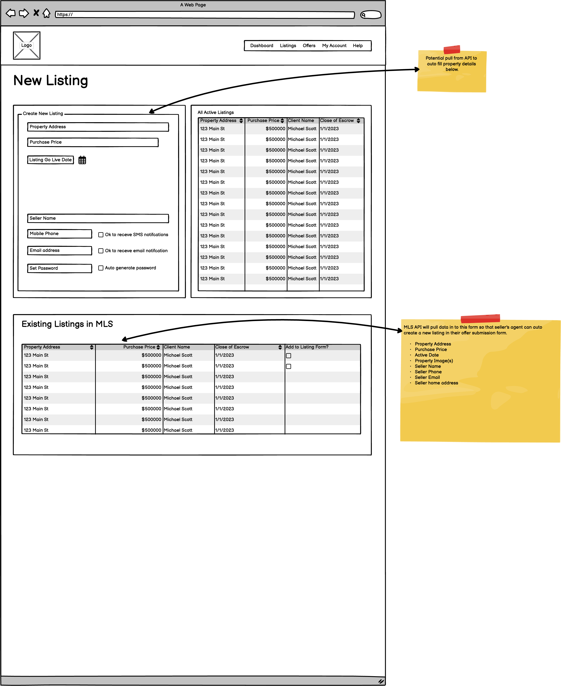
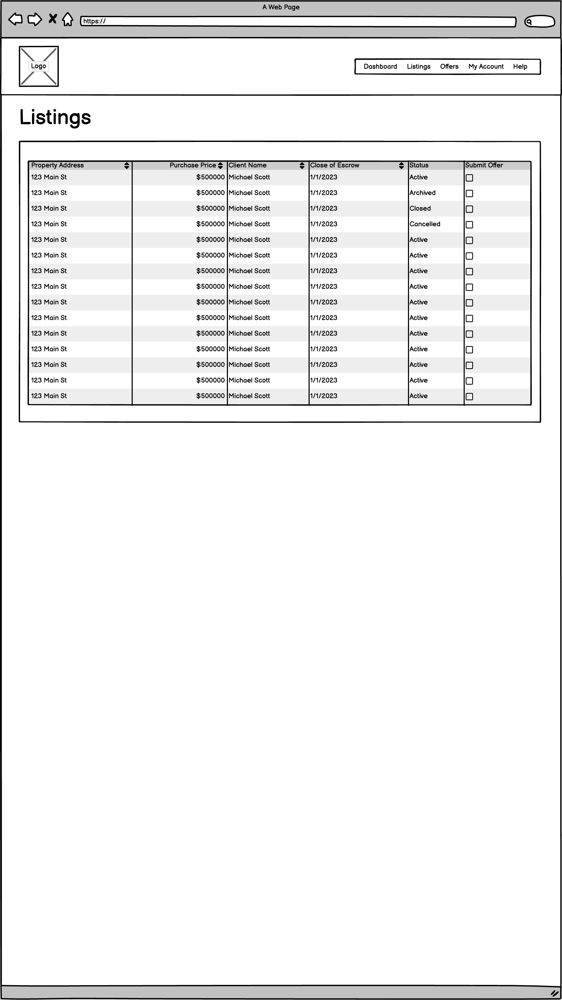
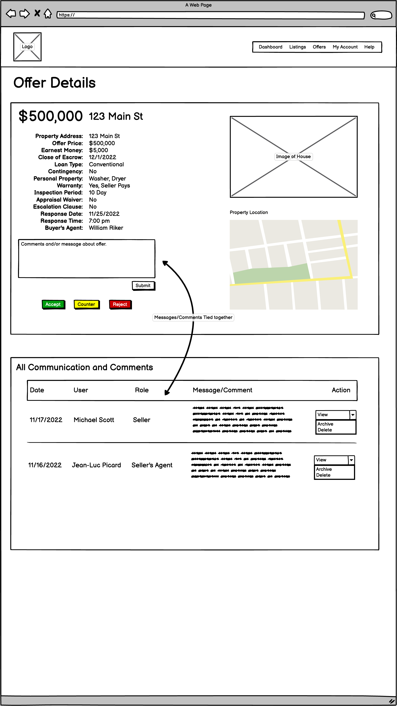
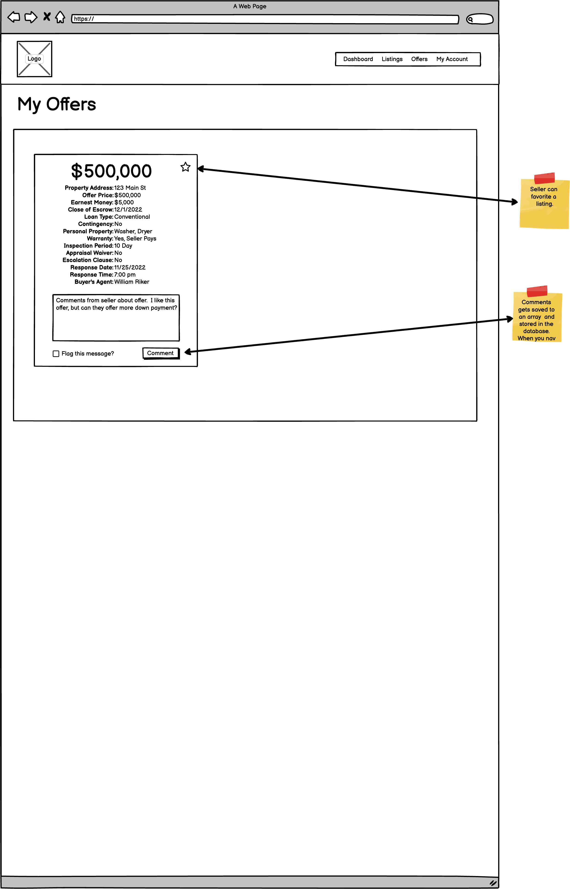
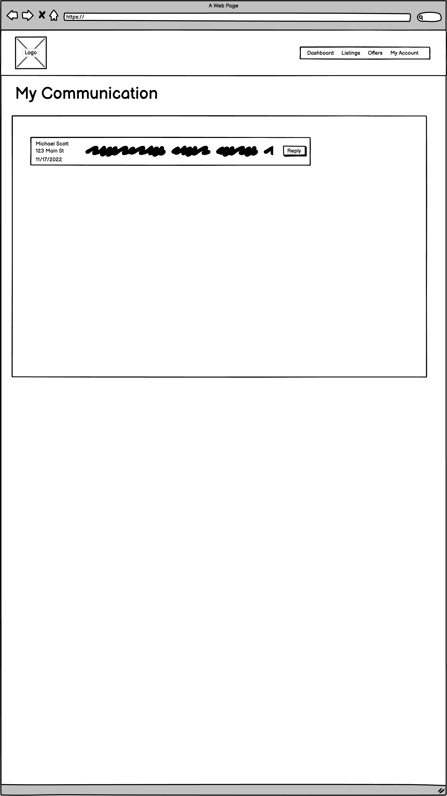
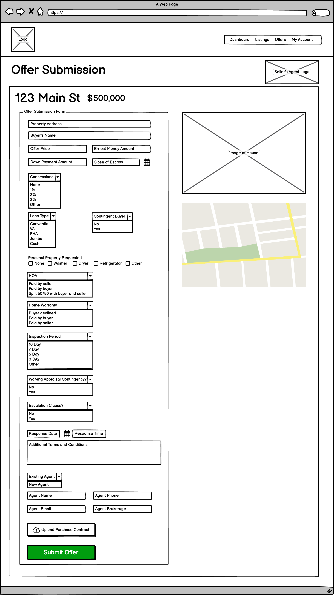
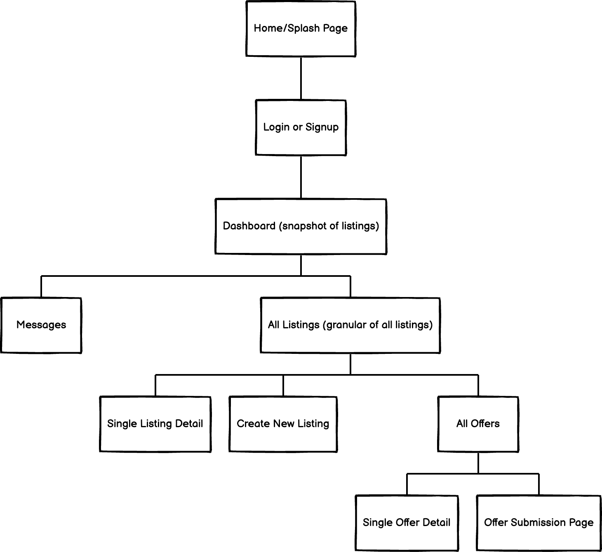

## Domain Model

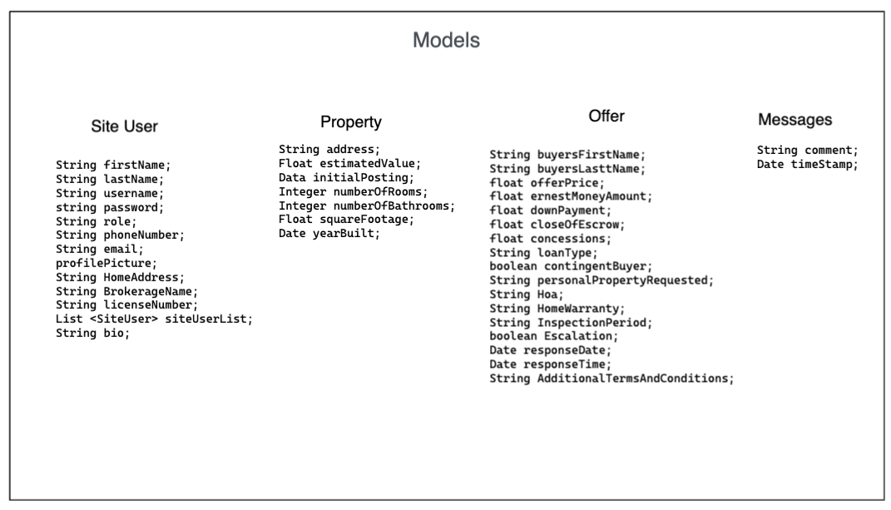
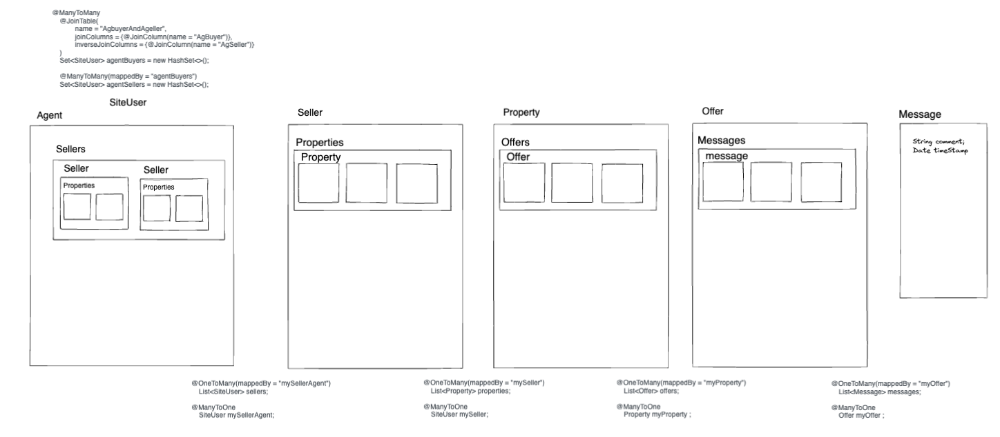
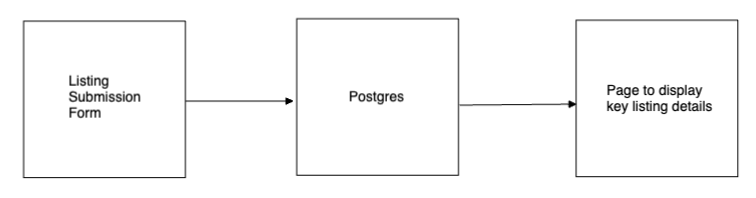
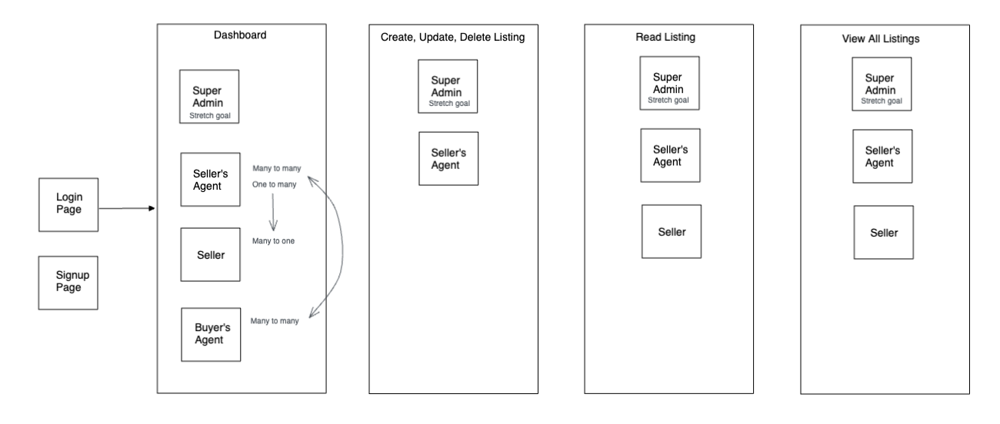

## Attribution

- [Chat Bubbles](https://www.w3schools.com/howto/tryit.asp?filename=tryhow_css_chat)
